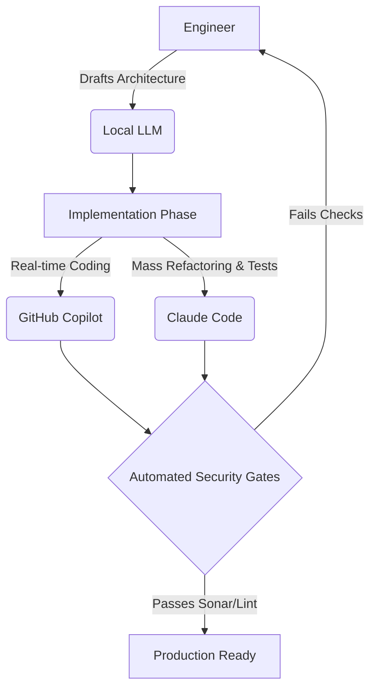

# The Shift to AI-Powered Delivery

In the highly regulated world of Digital Banking, security and compliance usually dictate how fast we can move. Moving fast and breaking things isn't an option when people's finances are on the line. 

However, by carefully integrating AI tools into our engineering workflows, we've managed to significantly boost our productivity without compromising our rigorous security standards.

## Our Secure AI Workflow

We don't just throw AI at the wall to see what sticks. We evaluate and adopt specific tools for specific jobs:
- **GitHub Copilot** acts as our real-time pair programmer for autocomplete and boilerplate generation.
- **Claude Code** operates as our autonomous agent for complex architecture refactoring and test generation.
- **Local LLMs** handle sensitive data and internal logic processing where data privacy is paramount.

Here is a visual breakdown of how a typical feature moves through our AI-assisted pipeline:

## Measuring the Impact

The results have been incredible. Since adopting these tools, our pull request (PR) review times have decreased by 30%. Writing boilerplate code that used to take hours now happens near-instantly. 

The key to this success isn't just the AI itself—it's providing our engineers with clear guardrails and automated security checks. We aren't replacing engineers; we're giving them superpowers so they can focus on solving complex business problems instead of writing repetitive syntax.
