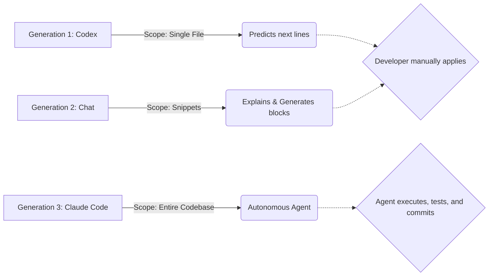

# From Autocomplete to Autonomy

When OpenAI's **Codex** (the model behind the original GitHub Copilot) first arrived, it felt like magic. It read your comments and predicted the next few lines of code. It was a glorified, albeit brilliant, autocomplete engine.

Today, tools like **Claude Code** represent a monumental paradigm shift: we've moved from *autocomplete* to *autonomy*.

## The Generational Shift

## Why Claude Code is Different

While Codex waits for you to type, Claude Code acts as a proactive agent in your terminal. You don't just ask it for a function; you give it a goal: 

> *"Refactor the authentication module to use JWTs, update all affected tests, and run the test suite."*

Claude Code will independently:
1. Search your codebase to find dependencies.
2. Edit multiple files across different directories.
3. Run terminal commands (like `npm test`).
4. Read the error logs and fix its own mistakes until the tests pass.

We are no longer just writing code faster; we are fundamentally elevating the level of abstraction at which software engineers operate.
