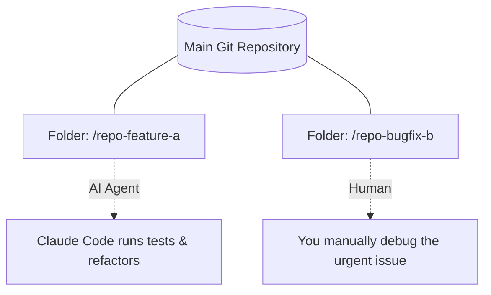

# Breaking the Linear Workflow

As developers, we all know the pain of context switching. You're deep into building a new feature, and suddenly a critical bug is reported in production. You have to `git stash` your changes, checkout `main`, create a hotfix branch, fix the bug, and then try to remember where you left off. It's frustrating and fragile.

Enter `git worktree`.

## What is a Git Worktree?

A git worktree allows you to check out multiple branches of the same repository into separate directories simultaneously. No more stashing. No more dirty working trees blocking your checkouts. 

When you pair this capability with autonomous AI coding agents like **Claude Code**, it becomes an absolute superpower.

## True Multitasking with AI

Here is how I structure my local development environment to achieve true parallelism:

I can have Claude Code running long test suites, linting, or performing large-scale codebase refactoring in one worktree folder, while I open another worktree folder in my IDE to manually debug an urgent issue. 

Because they are physically separated on my file system but linked to the same Git history, neither workflow interrupts the other. It literally feels like having a clone of yourself working right beside you.
