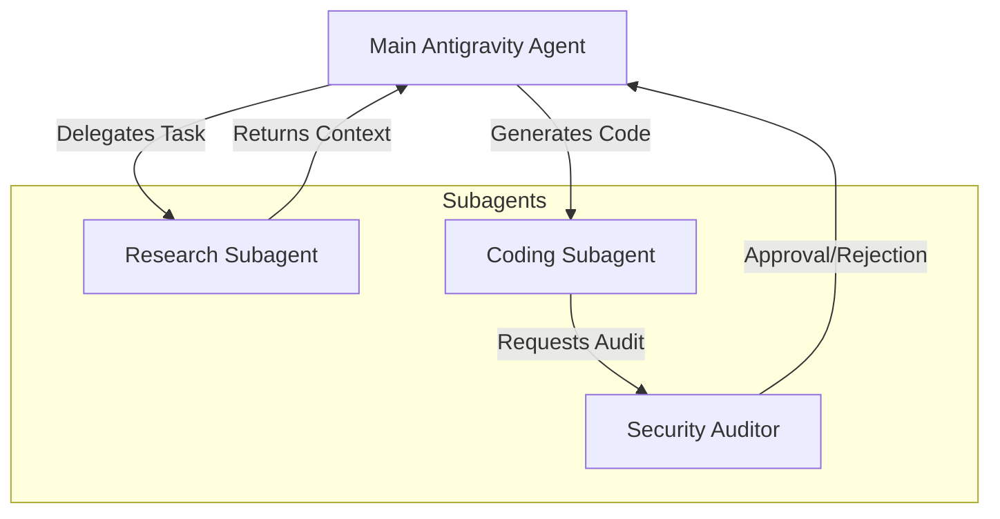

# The Multi-Agent Orchestration Problem

As AI use cases mature, a single monolithic agent is rarely enough. You need specialized agents: one for codebase research, one for security auditing, and one for writing code. 

Orchestrating these subagents, managing their state, and handling their tool permissions can quickly become an architectural nightmare. This is where the **Google Antigravity (AGY) SDK** shines.

## The Antigravity Ecosystem

Google Antigravity provides a robust Python SDK designed specifically for designing, implementing, and debugging autonomous AI multi-agent systems.

## Key Features

- **Built-in Multimodality**: Native support for passing images and PDFs into an agent's context.
- **Model Context Protocol (MCP)**: First-class support for attaching standard MCP tools directly to Antigravity agents.
- **Subagent Orchestration**: The ability to spawn isolated subagents that inherit capabilities or have entirely different personas.
- **Persistent State**: Built-in persistence layers so agents remember past interactions across multiple sessions.

By using Antigravity, we can stop writing boilerplate orchestrator code and focus on what matters: defining the right personas and tools for our agents.
