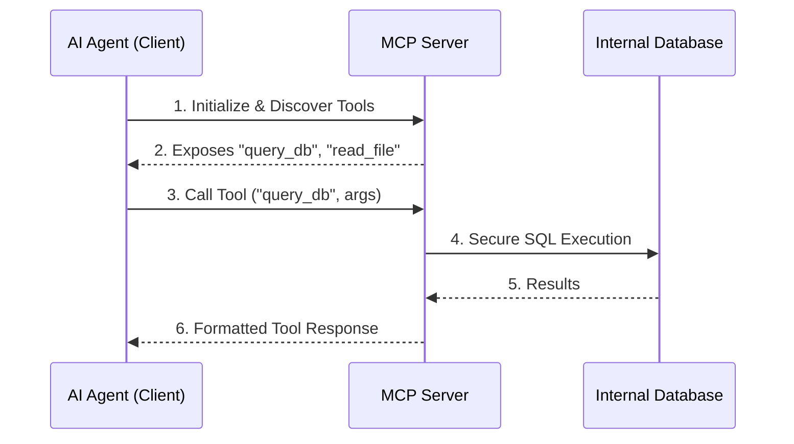

# The Integration Bottleneck

Historically, connecting an AI model to an internal database or external API meant writing custom glue code, managing unique authentication schemas, and constantly updating brittle endpoints.

The **Model Context Protocol (MCP)** solves this by creating a universal standard for how AI agents talk to tools.

## How MCP Works

Think of MCP like USB-C, but for AI models. Instead of writing custom integrations, you stand up an MCP Server that exposes tools (like querying a database or reading Jira tickets). The AI Agent (the MCP Client) securely discovers and calls these tools using a standardized protocol over stdio or Server-Sent Events (SSE).

## Security First

Because the MCP server runs on your own infrastructure (or locally on your machine), the LLM never gets direct access to your databases. The MCP server acts as a strict, secure proxy. 

By standardizing this interface, MCP is transforming AI agents from isolated chatbots into deeply integrated software engineers.
