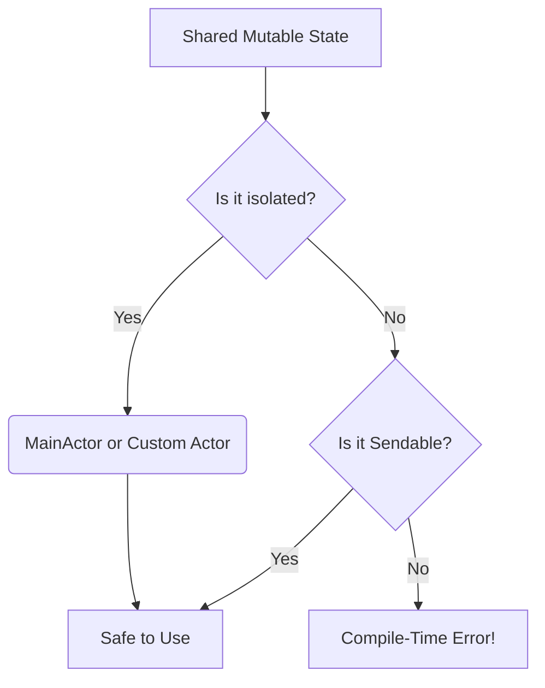

# The End of Unpredictable Crashes

For years, concurrent programming in iOS was a dangerous game. `DispatchQueue`, locks, and semaphores were powerful, but a single mistake could lead to unpredictable, notoriously hard-to-debug data races.

With the release of **Swift 6**, Apple has achieved something monumental: **complete data-race safety at compile time**.

## How Swift 6 Enforces Safety

Swift 6 achieves this through strict concurrency checking. It guarantees that mutable state is never accessed concurrently from multiple threads without proper synchronization.

### The Power of `Sendable` and Actors

- **Actors**: Actors isolate their state, ensuring that only one task can access their mutable properties at a time.
- **Sendable**: A protocol that indicates a type is safe to share across concurrent boundaries (e.g., value types like `structs` or immutable classes).

If you attempt to pass a non-Sendable type across an actor boundary, Swift 6 won't just warn you—it will fail to compile. While migrating large UIKit codebases to strict concurrency takes effort, the payoff is an app that simply cannot crash due to data races.
