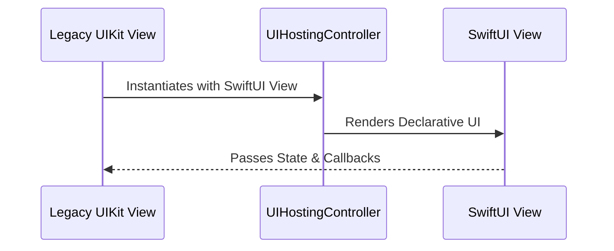

# The Challenge of Legacy Code

Migrating a massive, enterprise-grade banking application from UIKit to SwiftUI is no small feat. A "big bang" rewrite where you halt all feature development to rewrite the app from scratch is a recipe for disaster. 

Instead, it requires a balanced, pragmatic approach to ensure absolute stability for your users while gradually embracing the modern declarative UI paradigm.

## The Strangler Fig Pattern

For our UI layer, we adopted the Strangler Fig pattern—a strategy where you incrementally replace pieces of the old system with the new one until the old system can be safely removed. 

Our migration strategy breaks down into three core pillars:

1. **New Features First**: All net-new screens and isolated flows are built exclusively in SwiftUI.
2. **Hybrid Wrappers**: For legacy screens that need minor updates, we utilize `UIHostingController` extensively. This allows us to safely embed new SwiftUI views directly inside our existing UIKit hierarchies.
3. **Component Library Foundation**: Before migrating complex screens, we rebuilt our core design system (buttons, typography, text fields) in SwiftUI. This ensured visual consistency across both paradigms.

Here's how the hybrid architecture flows in practice:

## Move Fast, But Don't Break Things

By prioritizing incrementality, we completely minimized our risk profile. Users continued to get a smooth, reliable experience, while our engineering team was able to transition to a faster, more modern development cycle without halting business delivery.
